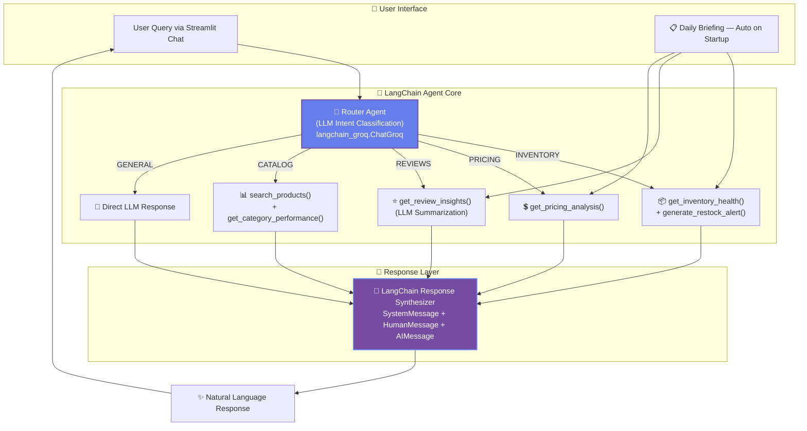

<div align="center">

<!-- Animated Header Banner -->


<!-- Animated Badge Row -->
[](https://python.org)
[](https://streamlit.io)
[](https://langchain.com)
[](https://groq.com)
[](LICENSE)

<br/>

> **An AI-powered product intelligence agent** that transforms how product managers interact with their catalog data. Ask questions in natural language, get instant insights backed by data, and receive proactive alerts — all through a beautiful conversational interface.

<br/>

<!-- Animated Typing Effect -->


</div>

---

## ✨ Capabilities at a Glance

<table>
<tr>
<td align="center" width="16%">

### 📦
**Inventory Health**
<br/>
<sub>Tracks stock levels, predicts stockout risk, generates urgency-sorted restock alerts with revenue-at-risk calculations</sub>

</td>
<td align="center" width="16%">

### 💲
**Pricing Analysis**
<br/>
<sub>Computes gross margins, classifies price positioning (Premium/Mid/Budget), flags dangerously low margins</sub>

</td>
<td align="center" width="16%">

### ⭐
**Review Insights**
<br/>
<sub>LangChain + LLM-powered sentiment analysis with theme extraction from customer reviews</sub>

</td>
<td align="center" width="16%">

### 📊
**Catalog Search**
<br/>
<sub>Natural language product discovery with intelligent scoring and category filtering</sub>

</td>
<td align="center" width="16%">

### 🏷️
**Category Metrics**
<br/>
<sub>Aggregated performance by category: SKUs, ratings, margins, revenue leaders</sub>

</td>
<td align="center" width="16%">

### 🔔
**Daily Briefing**
<br/>
<sub>Auto-generated startup report with top stockout risks, worst ratings, and margin anomalies</sub>

</td>
</tr>
</table>

---

## 🏗️ System Architecture

The agent uses an **LLM-powered Router Pattern** — each user query flows through intent classification → tool dispatch → response synthesis, all orchestrated by **LangChain**.



### Key Design Decisions

| Decision | Rationale |
|:---|:---|
| **LangChain for LLM orchestration** | Industry-standard framework; uses `ChatGroq`, `SystemMessage`, `HumanMessage`, `AIMessage` for structured message passing |
| **LLM-based routing (not regex)** | Semantic understanding of intent; handles ambiguous queries gracefully |
| **Tool result → LLM synthesis** | Raw data is always interpreted by the LLM before reaching the user, ensuring natural language output |
| **Conversation memory** | Enables multi-turn drill-downs (category → product → follow-up) without losing context |
| **Low temperature for classification (0.1)** | Ensures deterministic, consistent intent routing |
| **Higher temperature for responses (0.5)** | Enables natural, varied conversational output |

---

## 📂 Project Structure

```
retail-mind/
│
├── 🚀 run.py                     # Entry point → python run.py
├── 🎨 app.py                     # Streamlit UI (dark theme + glassmorphism)
│
├── 🤖 agent/
│   ├── __init__.py
│   ├── router.py                  # LangChain ChatGroq Router (intent → tool → response)
│   ├── memory.py                  # Multi-turn conversation memory manager
│   └── briefing.py                # Auto Daily Briefing engine
│
├── 🔧 tools/
│   ├── __init__.py
│   ├── search_products.py         # Tool 1: Text-matching product search
│   ├── inventory_health.py        # Tool 2: Stock health + days-to-stockout
│   ├── pricing_analysis.py        # Tool 3: Margin calc + price positioning
│   ├── review_insights.py         # Tool 4: LangChain LLM sentiment analysis
│   ├── category_performance.py    # Tool 5: Category-level aggregations
│   └── restock_alert.py           # Tool 6: Urgency-sorted stockout scanner
│
├── 📊 data/
│   ├── __init__.py
│   └── loader.py                  # Cached CSV loading via @st.cache_data
│
├── 📄 retailmind_products.csv     # 30 SKUs across 5 categories
├── 📄 retailmind_reviews.csv      # 40 customer reviews
├── 📋 requirements.txt            # All Python dependencies
├── 🔒 .env.example                # API key template (never commit real keys!)
├── 🚫 .gitignore                  # Excludes .env, __pycache__, etc.
└── 📖 README.md                   # You're reading it!
```

---

## 🚀 Quick Start

### Prerequisites

- **Python 3.9+**
- **Groq API Key** — Free at [console.groq.com](https://console.groq.com)

### Installation

```bash
# 1. Clone the repository
git clone https://github.com/agarwal-tanmay-work/creditsage-agent-TanmayAgarwal.git
cd creditsage-agent-TanmayAgarwal

# 2. Install dependencies (includes LangChain, Streamlit, Groq, etc.)
pip install -r requirements.txt

# 3. Configure environment
cp .env.example .env
# Edit .env and set: GROQ_API_KEY=gsk_your_key_here

# 4. Launch! 🚀
python run.py
```

The app will open at **`http://localhost:8501`** with the Daily Briefing auto-generated.

---

## 🔑 Environment Variables

| Variable | Description | Required |
|:---|:---|:---:|
| `GROQ_API_KEY` | API key from [Groq Console](https://console.groq.com) | ✅ |

> ⚠️ **Security**: Never commit real API keys. The `.gitignore` is configured to exclude `.env`.

---

## 🧪 Example Queries to Try

Test the agent across all 5 intent routes:

| Query | Expected Route | What Happens |
|:---|:---:|:---|
| *"Which products are critically low on stock?"* | `INVENTORY` | Runs `generate_restock_alert()` → urgency-sorted stockout list |
| *"What's the gross margin on SC018?"* | `PRICING` | Runs `get_pricing_analysis('SC018')` → 63.99% margin, Premium |
| *"What are customers saying about the Velvet Party Dress?"* | `REVIEWS` | Runs `get_review_insights('SC011')` → LLM sentiment + themes |
| *"Show me all Accessories"* | `CATALOG` | Runs `search_products()` + `get_category_performance()` |
| *"Hello, what can you do?"* | `GENERAL` | Direct LLM response about capabilities |
| *"Which dresses should we restock?"* | `INVENTORY` | Filtered restock alerts for Dresses category |
| *"What's the best performing category?"* | `CATALOG` | Category metrics comparison |
| *"Is SC004 priced correctly?"* | `PRICING` | Pricing analysis with margin flag |
| *"Customer complaints for SC025"* | `REVIEWS` | Review insights showing negative themes |
| *"Top revenue products in Outerwear?"* | `CATALOG` | Category performance with top 3 by revenue |

---

## 🦜 LangChain Integration Details

This project uses **LangChain** as the core LLM orchestration framework:

```python
# Router uses LangChain's ChatGroq + message types
from langchain_groq import ChatGroq
from langchain_core.messages import SystemMessage, HumanMessage, AIMessage

# Intent Classification (temperature=0.1 for deterministic routing)
llm = ChatGroq(model="llama-3.3-70b-versatile", temperature=0.1)
messages = [SystemMessage(content=ROUTER_PROMPT), HumanMessage(content=query)]
classification = llm.invoke(messages)

# Review Sentiment Analysis (temperature=0.3 for factual analysis)
llm = ChatGroq(model="llama-3.3-70b-versatile", temperature=0.3)
messages = [SystemMessage(content=REVIEW_PROMPT), HumanMessage(content=reviews)]
insights = llm.invoke(messages)

# Response Generation (temperature=0.5 for natural language)
llm = ChatGroq(model="llama-3.3-70b-versatile", temperature=0.5)
messages = [SystemMessage(...), *history, HumanMessage(content=tool_results)]
response = llm.invoke(messages)
```

### LLM Parameter Choices (Commented in Code)

| Parameter | Value | Rationale |
|:---|:---:|:---|
| `temperature` (router) | `0.1` | Ensures consistent, deterministic intent classification |
| `temperature` (reviews) | `0.3` | Factual sentiment analysis with minimal hallucination |
| `temperature` (response) | `0.5` | Natural, varied conversational output |
| `max_tokens` (router) | `150` | Classification JSON is compact |
| `max_tokens` (reviews) | `300` | Structured JSON with themes |
| `max_tokens` (response) | `800` | Rich, detailed natural language |
| `top_p` | `0.9–0.95` | Focused output without being overly restrictive |
| `model` | `llama-3.3-70b-versatile` | Best balance of capability and speed on Groq |

---

## 🛠️ Tech Stack

<div align="center">

| Technology | Purpose | Why This Choice |
|:---:|:---|:---|
| 🐍 **Python 3.9+** | Core language | Industry standard for AI/ML |
| 🦜 **LangChain** | LLM orchestration | `ChatGroq`, `SystemMessage`, `HumanMessage`, `AIMessage` for structured agent design |
| ⚡ **Groq** | LLM inference | Ultra-fast LPU; free tier; `llama-3.3-70b-versatile` |
| 🎈 **Streamlit** | Web UI framework | Rapid prototyping with chat interface support |
| 🐼 **Pandas** | Data processing | Fast CSV operations and aggregation |
| 🔐 **python-dotenv** | Secret management | Keeps API keys out of source code |

</div>

---

## 📊 Dataset Overview

### `retailmind_products.csv` — 30 SKUs

| Column | Type | Description |
|:---|:---:|:---|
| `product_id` | String | Unique ID (SC001–SC030) |
| `product_name` | String | Full product name |
| `category` | String | Tops / Dresses / Bottoms / Outerwear / Accessories |
| `price` | Float | Selling price (INR) |
| `cost` | Float | Cost of goods (INR) |
| `stock_quantity` | Integer | Current inventory |
| `avg_daily_sales` | Float | 30-day average daily units sold |
| `return_rate` | Float | Return percentage (0–1) |
| `avg_rating` | Float | Customer rating (1.0–5.0) |
| `review_count` | Integer | Total reviews |
| `launch_date` | Date | Product launch date |
| `reorder_level` | Integer | Reorder trigger threshold |

### `retailmind_reviews.csv` — 40 Reviews

| Column | Type | Description |
|:---|:---:|:---|
| `review_id` | Integer | Unique review ID |
| `product_id` | String | Links to products CSV |
| `reviewer_name` | String | Customer first name |
| `rating` | Integer | Star rating (1–5) |
| `review_title` | String | Review headline |
| `review_text` | String | Full review body |
| `verified_purchase` | Boolean | Purchase verified |
| `helpful_votes` | Integer | Helpfulness votes |
| `review_date` | Date | Review date |

---

<div align="center">

<!-- Footer Wave -->


**Built with 💡 precision and ⚡ speed**

*RetailMind Analytics © 2026 — Building AI Agents Mid-Term Examination (Set-B)*

</div>
