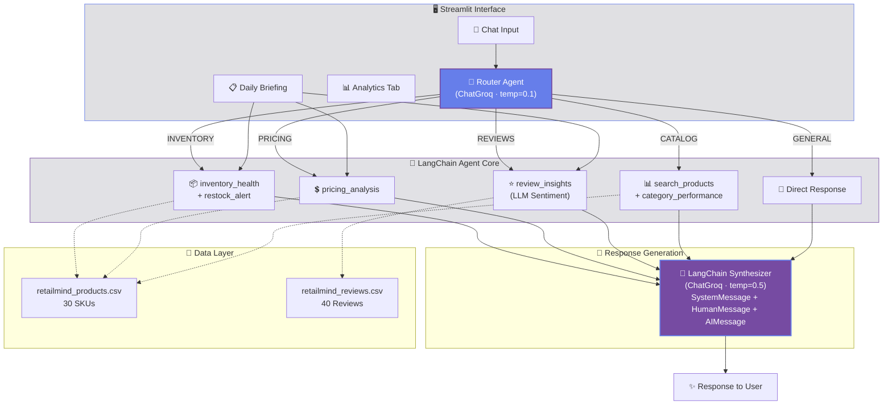

<div align="center">

<!-- Animated Waving Header -->


<br/>

<!-- Badges -->
[](https://python.org)
[](https://streamlit.io)
[](https://langchain.com)
[](https://groq.com)
[]()
[]()

<br/>

<!-- Typing Animation -->
<a href="#"></a>

<br/>

</div>

---

## 📌 About

**RetailMind AI** is an intelligent product analytics agent built for **StyleCraft**, a D2C fashion brand with 30 active SKUs across 5 categories. It replaces 4–5 hours of manual weekly analysis with instant, conversational intelligence powered by **LangChain** and **Groq LLMs**.

> 💡 Built for the **Building AI Agents Mid-Term Examination (Set-B)** — UGDSAI Semester II

---

## ✨ Features

<table>
<tr>
<td width="50%">

### 🤖 AI Agent Core
- **LLM-Powered Router** — Intent classification via LangChain (not keyword matching)
- **6 Specialized Tools** — Inventory, Pricing, Reviews, Search, Category, Restock
- **Multi-Turn Memory** — Drill down from category → product → follow-up
- **Daily Briefing** — Auto-generated critical alerts on startup

</td>
<td width="50%">

### 📊 Analytics Dashboard
- **Interactive Charts** — Plotly visualizations for category metrics
- **Catalog Summary Panel** — Always-visible KPI cards with live data
- **Category Filtering** — Sidebar scope control across all views
- **Quick Action Buttons** — One-click access to common queries

</td>
</tr>
<tr>
<td width="50%">

### 🎨 Premium UI
- **Dark Glassmorphic Theme** — Frosted glass cards, gradient animations
- **CSS Micro-Animations** — Fade-in, pulse, slide-in effects
- **Responsive Layout** — Wide mode with intelligent spacing
- **Google Fonts (Inter)** — Typography that feels premium

</td>
<td width="50%">

### 🛡️ Robustness
- **Graceful Error Handling** — Missing API keys, bad inputs, edge cases
- **Input Validation** — Handles empty queries, unknown product IDs
- **LLM Fallback** — Provides basic analysis if API call fails
- **Result Caching** — Avoids redundant LLM calls for reviews

</td>
</tr>
</table>

---

## 🏗️ Architecture



---

## 📂 Project Structure

```
📦 retail-mind/
├── 🚀 run.py                        ← Entry point (python run.py)
├── 🎨 app.py                        ← Streamlit UI with dark theme
│
├── 🤖 agent/
│   ├── router.py                     ← LangChain ChatGroq router
│   ├── memory.py                     ← Conversation memory manager
│   └── briefing.py                   ← Daily briefing engine
│
├── 🔧 tools/
│   ├── search_products.py            ← Tool 1: Product search
│   ├── inventory_health.py           ← Tool 2: Stock health
│   ├── pricing_analysis.py           ← Tool 3: Margin analysis
│   ├── review_insights.py            ← Tool 4: LLM sentiment
│   ├── category_performance.py       ← Tool 5: Category metrics
│   └── restock_alert.py              ← Tool 6: Restock alerts
│
├── 📊 data/
│   └── loader.py                     ← Cached CSV loading
│
├── 📄 retailmind_products.csv        ← 30 products
├── 📄 retailmind_reviews.csv         ← 40 reviews
├── 📋 requirements.txt
├── 🔒 .env.example
└── 📖 README.md
```

---

## 🚀 Quick Start

```bash
# 1️⃣ Clone
git clone https://github.com/agarwal-tanmay-work/retailmind-agent-TanmayAgarwal.git
cd retailmind-agent-TanmayAgarwal

# 2️⃣ Install
pip install -r requirements.txt

# 3️⃣ Configure
cp .env.example .env
# Edit .env → GROQ_API_KEY=gsk_your_key_here

# 4️⃣ Launch
python run.py
```

> App opens at **http://localhost:8501** with Daily Briefing auto-generated ✨

---

## 🦜 LangChain Integration

All LLM interactions use **LangChain** (`langchain_groq` + `langchain_core`):

```python
from langchain_groq import ChatGroq
from langchain_core.messages import SystemMessage, HumanMessage, AIMessage

# Router — deterministic classification
llm = ChatGroq(model="llama-3.3-70b-versatile", temperature=0.1)

# Reviews — factual sentiment analysis
llm = ChatGroq(model="llama-3.3-70b-versatile", temperature=0.3)

# Responses — natural conversation
llm = ChatGroq(model="llama-3.3-70b-versatile", temperature=0.5)
```

| Parameter | Router | Reviews | Response | Why |
|:---|:---:|:---:|:---:|:---|
| `temperature` | 0.1 | 0.3 | 0.5 | Low → deterministic; High → natural |
| `max_tokens` | 150 | 300 | 800 | Sized to output type |
| `top_p` | 0.95 | 0.9 | 0.9 | Focused without being restrictive |

---

## 🧪 Test Queries

| Query | Route | Tool(s) Called |
|:---|:---:|:---|
| *"Which products are critically low on stock?"* | INVENTORY | `generate_restock_alert()` |
| *"What's the gross margin on SC018?"* | PRICING | `get_pricing_analysis()` |
| *"What are customers saying about SC011?"* | REVIEWS | `get_review_insights()` |
| *"Show me all Accessories"* | CATALOG | `search_products()` + `get_category_performance()` |
| *"Hello, what can you do?"* | GENERAL | Direct LLM response |

---

## 🔑 Environment Variables

| Variable | Required | Source |
|:---|:---:|:---|
| `GROQ_API_KEY` | ✅ | [console.groq.com](https://console.groq.com) (free) |

> ⚠️ Never commit API keys — `.gitignore` excludes `.env`

---

## 🛠️ Tech Stack

| Tech | Role |
|:---:|:---|
| 🐍 Python | Core language |
| 🦜 LangChain | LLM orchestration (`ChatGroq`, message types) |
| ⚡ Groq | Ultra-fast inference (Llama 3.3 70B) |
| 🎈 Streamlit | Web UI with chat interface |
| 📊 Plotly | Interactive analytics charts |
| 🐼 Pandas | Data processing |
| 🔐 python-dotenv | API key management |

---

<div align="center">


**Built with 💡 precision and ⚡ speed** · RetailMind Analytics © 2026

</div>
